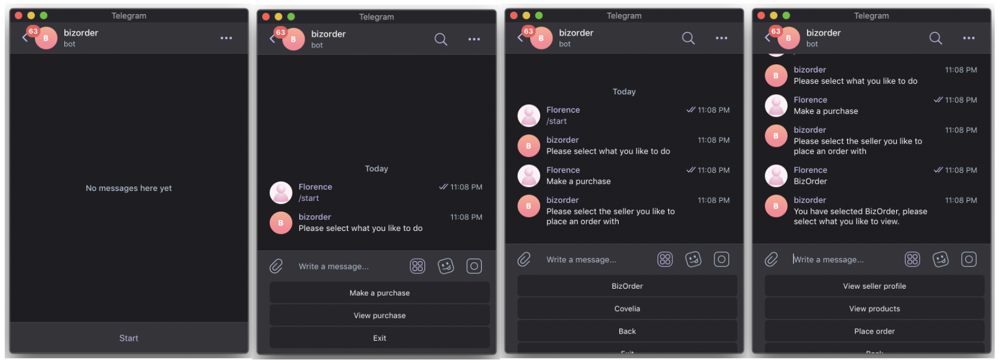
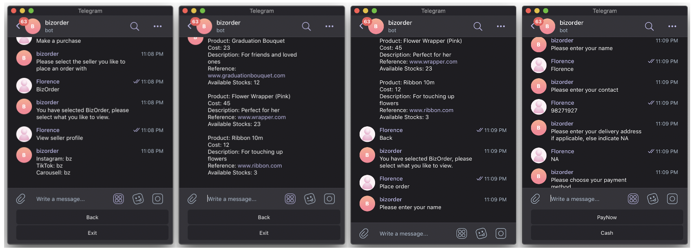
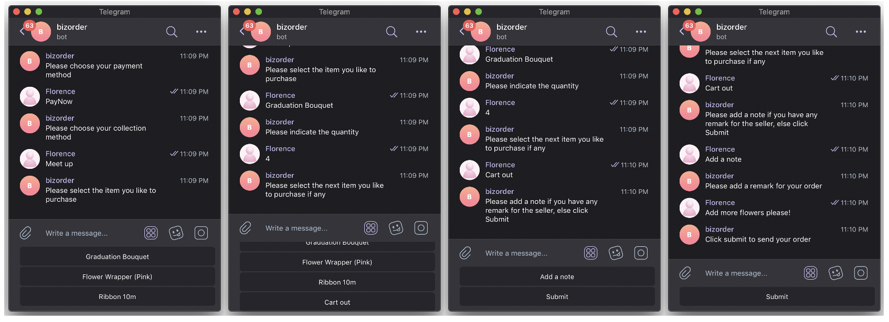
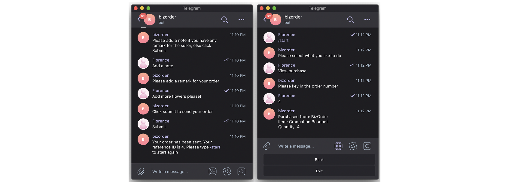

# BizOrder Management System - Telegram Bot

## Overview
The Telegram bot component of the BizOrder Management System project automates customer interactions and order management through Telegram, streamlining the process for both customers and business owners.

GitHub Repository for Frontend (Angular): <a href="https://github.com/christiinelim/business-management-system">Link</a>

## Functionalities

### Customer Interaction
- **Seller's Products**: Customers can view the seller's profile and their available products through the bot.
- **Availability Check**: Customers can check the availability of products through the bot.
- **Product Selection**: Customers can select items they want to order from the bot's menu.
- **Order Placement**: Customers can place orders directly through the Telegram bot.

## Telegram Bot

## Future Enhancements
- **Product Image Viewing**: Enhance customer experience by enabling the bot to send images of products for customers to view and make informed purchasing decisions.
- **Advanced Order Tracking**: Implement advanced order tracking features for customers to track their orders in real-time.